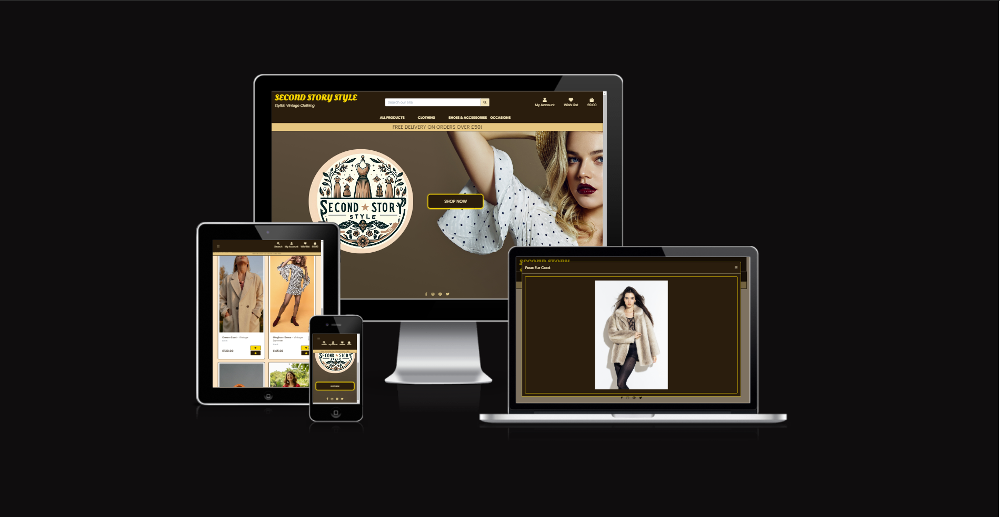 

[Visit the website here](https://second-story-style-f8b69cba54dc.herokuapp.com/)


## **UX-User Experience Design**

<br>

## **Strategy Plane**

<br>

**The business goals for the website:**

**Increase Sales and Revenue:** 
   - Facilitate seamless purchasing by offering intuitive navigation, search, and sorting features.
   - Implement a user-friendly checkout process to minimize cart abandonment.

**Enhance Customer Engagement:**
   - Provide a personalized user experience by leveraging features like a wishlists and user profiles.
   - Implement registration and account management features to build customer loyalty and engagement.

**Expand Market Reach:**
   - Design for mobile, tablet, and desktop screens to reach a wider audience across devices.
   

**Optimize Product Management:**
   - Enable easy management of products through adding, editing, and deleting functionalities.
   - Allow categorization and filtering for effective product browsing.

**Improve Operational Efficiency:**
   - Provide admin tools for managing users, reviewing sales , and tracking inventory.

**Boost Customer Trust and Security:**
   - Implement secure payment gateways to ensure customer data protection.
  
<br>

## User Stories

### Viewing and Navigation

| As a Shopper, I want to be able to... |
|---------------------------------------|
| Easily navigate the site and find the products that I need. |
| View a category of products/filter products to find specific items I am interested in. |
| View more detail on products and read their descriptions. |
| View a close-up of a product image. |
| View my running total of purchases throughout my visit. |
| View the items I currently have selected for purchase and adjust the shopping bag if needed. |
| Add products to a wishlist. |

### Registration and User Accounts

| As a Shopper, I want to be able to... |
|---------------------------------------|
| Register for an account and view my profile. |
| Receive an email to confirm my registration. |
| Log in and out to keep my account information secure. |
| View a profile page, set a default delivery address, and view previous purchases. |
| Reset my password. |

### Sorting and Searching

| As a Shopper, I want to be able to... |
|---------------------------------------|
| Sort the list of available products by categories, size, price, and brand. |
| Search for a product by name or description. |

### Purchasing and Checkout

| As a Shopper, I want to be able to... |
|---------------------------------------|
| View items in my bag to be purchased. |
| Adjust the bag and make changes to my purchase before checkout. |
| Easily enter my payment information. |
| Feel that my personal and payment information is safe and secure. |
| View an order confirmation after checkout to verify that I haven't made any mistakes. |
| Receive an email confirmation after checking out. |

### Admin and Store Management

| As a Store Administrator, I want to be able to... |
|--------------------------------------------------|
| Add a product - add new items to my store. |
| Edit/update a product - change product prices, descriptions, images, and other product criteria. |
| Delete a product - remove items that are no longer for sale. |

<br>

## Scope Plane

In order to achieve the strategy goals, the following features are included on the website:

**User Authentication and Profile Management:**
   - Register, log in, and manage a user profile.
   - Ability to reset passwords and update personal information.
   - View order history and manage wishlists.

**Product Management:**
   - Admin features to add, edit, or delete products.
   - Categorize products and apply filters for easier browsing.
   - Product details include images, descriptions, pricing, and inventory status.

**Shopping Experience:**
   - Search and filter products based on various attributes.
   - View a running total of items in the shopping bag throughout the session.
   - Adjust items in the shopping bag before checkout.
   - View and update a wishlist.

**Checkout and Payments:**
   - Streamlined checkout process with secure payment gateways.
   - Order confirmation page to verify order details.
   - Email confirmation for orders.

**Error Handling and User Support:**
   - Custom 404 and 500 error pages redirect users to the Home Page for broken links or server issues.
   - FAQ and contact pages to assist users with common questions or issues.

**Responsive Design:**
   - Ensure the website is accessible and functional across mobile, tablet, and desktop devices.
   
<br>

## **Structure Plane** 

<br>

The structure plane of "The Second Story Style Shop" ensures seamless navigation and user experience by organizing key pages effectively. the **Home Page** serves as the gateway to the site, with the **Products Page** offering an overview of available items. Users can explore detailed information on **Product Detail Page**. For user management, the Sign Up Page and Sign In Page cater to new and existing customers, while administrative features like the **Add New Product Page** and **Edit Product Page** support catalog management.

Shopping is streamlined through the **Shopping Bag Page** and **Wishlist Page**, while the **Checkout Page** and **Checkout Success** pages guide customers through the purchasing process. The **My Profile Page** provides a personalized account management experience. In case of navigation issues, the **404** and **500** Error Pages redirect users to the Home Page, ensuring smooth navigation despite broken links or errors.

<br>


## **Surface Plane**

<br>

**Colour Scheme**

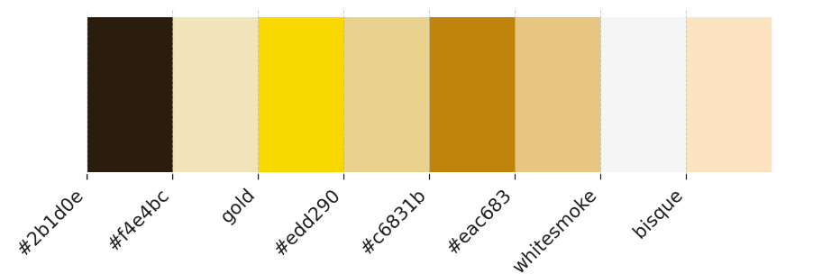

The colour palette  was chosen to echo the unique, timeless appeal of vintage fashion while ensuring an inviting and user-friendly website experience. Each colour in the palette supports the brand’s vintage aesthetic and enhances the overall visual harmony of the website.

Deep Coffee Brown serves as the foundational color, providing a sophisticated and robust backdrop that resonates with the rich history of vintage garments. This colour is ideal for creating a feeling of depth and elegance, often used in text and footer backgrounds to ground the lighter shades.

Almond Cream is used to soften the intensity of the darker brown, offering a creamy contrast that makes the site feel warm and welcoming. Its usage in backgrounds and hover states ensures a smooth visual flow and readability, essential for engaging users.

Metallic Gold and Pale Gold are colors are used to highlight call-to-action buttons and interactive elements, making them stand out and capturing the user's attention.

Bronze introduces a mid-tone that bridges the lighter and darker shades in the palette. It’s strategically employed in headings and widgets to draw focus and guide the user's journey through the website, enhancing navigational cues and emphasizing important content.

Peach Puff and Bisque provide background variations that are both soothing and neutral, creating spaces on the website that are easy on the eyes and conducive to reading. 

Whitesmoke and gold are strategically utilized for the "Keep Shopping" and "Cancel" buttons to ensure clarity and provide a contrast with other buttons that feature gold and brown tones. This color choice enhances the visibility of these buttons, making them easily distinguishable from other interactive elements on the site.

<br>

**Typography**

I used two fonts:

Oleo Script for logo and flipper back text

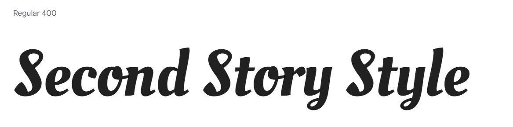

and Poppins for the remaining content of the website

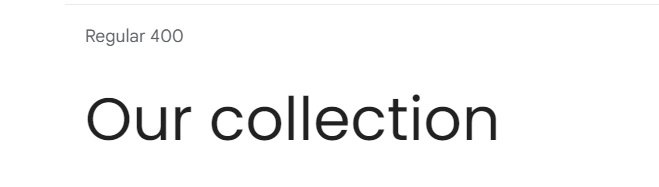

Oleo Script, with its flowing, curvaceous style, is used for the logo and decorative elements. This font effectively captures the charm and character of past eras, making it ideal for highlighting the unique identity of a vintage shop.

Poppins, on the other hand, is utilized for the main content of the website due to its clean and modern appearance. This sans-serif font offers excellent readability and a contemporary feel, providing a pleasant visual contrast to the more ornate Oleo Script. 

**Imagery**

The background photo showcases a stylishly dressed woman wearing a hat, which sets the tone for the shop's collection. The shop's logo, presented in warm brown vintage hues, features images of vintage-style dresses that signify the shop's dedication to offering timeless and unique pieces. In line with the shop's aesthetic, all product images are framed with a brown border that transitions to gold when hovered over, harmonizing with the website's color scheme. Image modals are displayed against a brown background framed with a golden border, evoking the charm of vintage photography.

<br>

## **Skeleton Plane**

</br>

To follow best practices, wireframes were developed for mobile, tablet, and desktop sizes. The site wireframes were designed using [Balsamiq](https://balsamiq.com/wireframes). Images of all wireframes can be found in the documentation folder: [Wireframes](docs/wireframes).

The final design of the home page differs from my original vision. It now features a background image with a fashionably dressed woman. The shop's flippable logo is on the left side of the screen, and the "Shop" button is prominently centered.

For medium and small screens, the background image is replaced with a blank one, the logo is centered, and the "Shop" button is placed vertically below the logo.


</br>


## **Features**

- **Navigation Bar**

<br>

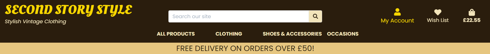

<br>

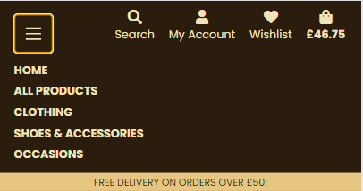

The Second Story Style shop features a comprehensive and intuitive navigation bar designed to enhance the user experience on both desktop and mobile devices. Anchored at the top of every page, the navigation bar remains fixed for easy access throughout the user's journey on the site. It incorporates the shop's name "SECOND STORY STYLE" on the left, serving as a home link for quick returns to the main page. Central to the navigation bar is search functionality, enabling customers to effortlessly find vintage clothing and accessories by inputting keywords into the search box. 

The navigation bar adapts dynamically for user account management based on the user's authentication status. Authenticated users have quick links to their profiles, wish lists, and a logout option, while unauthenticated visitors are provided with links to register or log in. The rightmost section of the navbar offers direct access to the wish list and shopping bag, with visual cues like icons and dynamic updates to indicate the current state of the shopping bag, including total cost. For mobile users, the navigation bar simplifies into a collapsible hamburger menu, ensuring that functionality is preserved without compromising the user interface.

Additionally, the site promotes a customer-friendly shopping incentive with a delivery banner that spans the full width of the page just below the main navigation bar. This banner advertises free delivery for orders exceeding a specified threshold, clearly communicating this benefit to customers and encouraging larger purchases. 

<br>

- **Dropdown Menu**
<br>

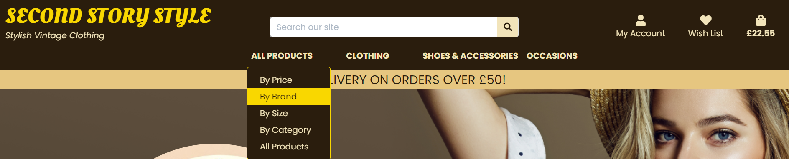

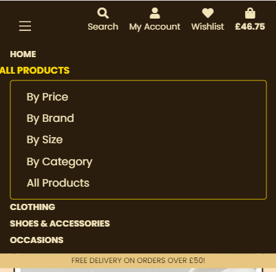

 Dropdown menu integrated into the navigation bar enhances the browsing experience by making it easy for customers to find products according to specific categories and preferences. Each dropdown is organized under clear headings such as "All Products," "Clothing," "Shoes & Accessories," and "Occasions." 

Under the "All Products" menu, users can sort items by price, brand, size, or category, allowing for a personalized shopping experience that can match different budgets and preferences. The "Clothing" section offers sub-categories like Dresses, Tops, Trousers, and Coats, providing quick access to specific product types. For those looking for footwear or fashion accessories, the "Shoes & Accessories" dropdown presents options like Shoes, Jewellery, Bags, and Hats. Additionally, the "Occasions" dropdown caters to customers seeking attire for special events, with selections such as Wedding attire and Ball Gowns. Each menu item is linked to a filtered view of products on the shop’s main product page, where customers can browse through items that meet the chosen criteria.

<br>

- **Footer**


<br>


The footer of the Second Story Style provides easy access to the brand's social media platforms. Strategically designed to be both functional and aesthetically pleasing, the footer is featured on every page and includes prominently displayed social media icons that link to the shop’s Facebook, Instagram, Pinterest, and Twitter profiles.

Each social media icon in the footer is adaptive, changing color based on the page the user is currently viewing. On the homepage, the icons appear with a lighter design (social-icon-light), enhancing visibility against typically vibrant home page content. On all other pages, the icons shift to a darker theme (social-icon-dark), ensuring that they remain visually harmonious with the rest of the site’s design while still standing out to the user.

<br>

- **Favicon**

<br>

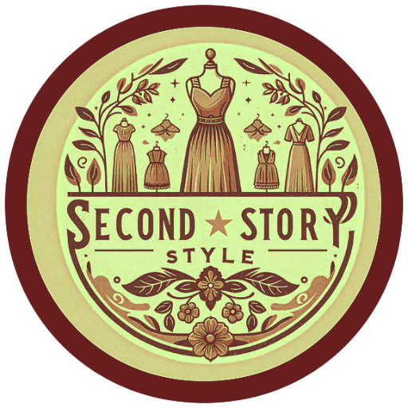

The website features a distinctive favicon, which is a small but crucial element of its branding. This favicon is derived from the Second Story Style logo, modified to include a vintage filter, enhancing its retro appeal. The use of a vintage filter on the favicon not only harmonizes with the shop's vintage clothing theme but also makes the site's tab instantly recognizable in a browser full of tabs. 

<br>

- **Home Page**

<br>

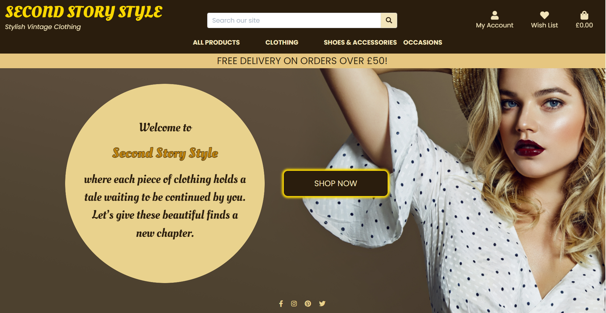

<br>

The home page of the Second Story Style website features an elegant and interactive design tailored to enhance user engagement and highlight the unique branding of the vintage clothing shop. At the core of the page is a "flip-container," an interactive element where users can click to reveal more information about the store. This container is strategically placed next to a prominent "Shop Now" button on larger screens, facilitating easy navigation to the product pages. All of this is set against a captivating background photo of a fashionably dressed woman wearing a hat, which reinforces the vintage theme of the shop.

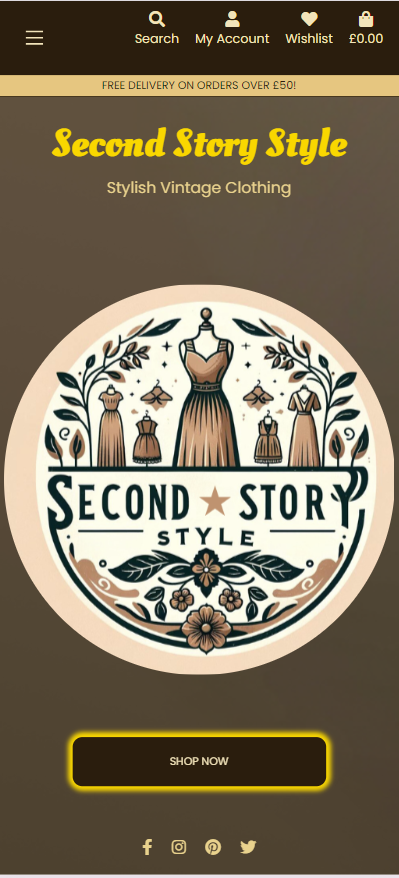

On smaller devices, the layout adjusts for optimal viewing by stacking the logo and the "Shop Now" button vertically, maintaining accessibility and user-friendliness. To ensure clarity and maintain the focus on the content, the background photo of a fashionably dressed woman wearing a hat on larger screens is switched to a plain background on smaller devices. This adjustment enhances text readability and optimizes loading times, ensuring that the user experience remains seamless and engaging across all device sizes.

<br>

- **Products Page**

<br>

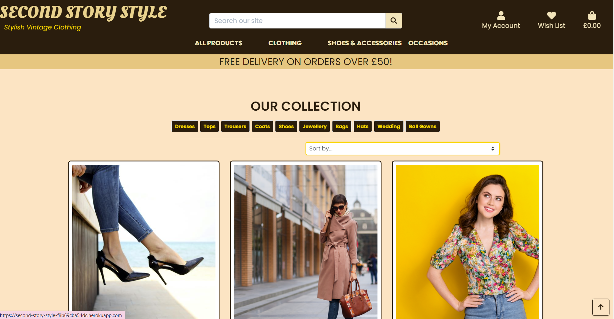

The Products Page features a clean and intuitive layout that effectively showcases the shop's diverse collection of vintage clothing. Each product is displayed in a card format featuring a clear image, a detailed description, and pricing information, ensuring that customers can easily navigate and identify items that capture their interest. This page also benefits from a dynamic sorting feature that allows users to organize the displayed products based on various criteria such as price, name, category, and size. This sorting is facilitated through a straightforward dropdown menu, enabling customers to tailor their browsing experience according to their preferences.

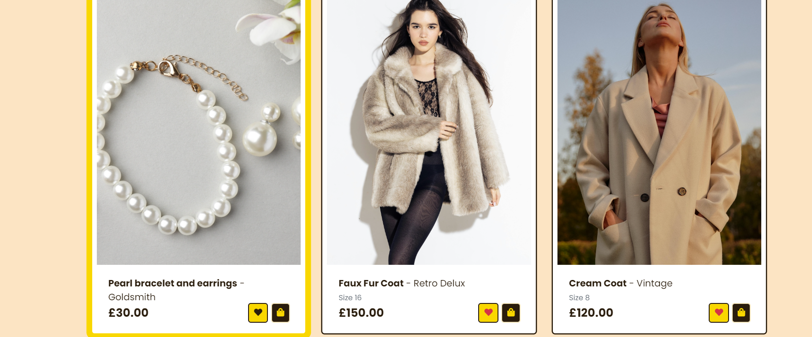


Interactive elements on the page enhance functionality and user engagement. Authenticated users can interact with wishlist and shopping bag buttons: clicking the heart icon on a product card adds the item to their wishlist and turns the icon red, signaling that the item has been added. If a user wishes to remove an item from their wishlist, a second click on the heart icon will remove the item, and the icon will change back to its original dark brown color. This provides a clear and intuitive visual cue for the user. For those not logged in, the wishlist button prompts them to log in, ensuring a seamless experience. The shopping bag button is available to all users, allowing them to quickly add items to their cart.

Additionally, a discreet "Back to Top" button is included to enhance navigation, making it easy for users to return to the top of the page after extensive browsing, further smoothing the shopping experience on the Products Page.

<br>

- **Product Detail Page**

<br>

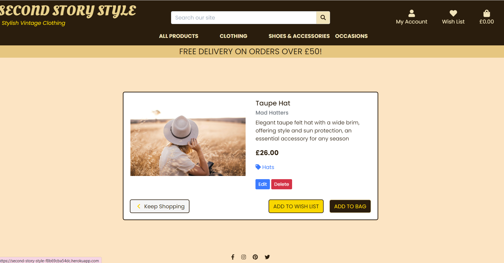


The Product Detail Page on the website provides customers with a comprehensive view of each item, facilitating an informed and satisfying shopping experience. This page features a clean, structured layout that showcases product images prominently. Users can click on these images to view them in a larger modal, enhancing visual engagement. Detailed descriptions accompany each product, including information on brand, price, size, and category, which helps customers make purchasing decisions.


For added convenience, the page includes direct links to filter products by category, enhancing the shopping experience by connecting customers with similar items. Superuser actions such as edit and delete buttons are discreetly integrated, allowing easy management for administrators directly from the frontend.

Additionally, the page is equipped with functionality to add items to the wishlist or the shopping bag. This process is streamlined through forms directly on the page, with options for authenticated users to add directly and prompts for unauthenticated users to log in. 

<br>

- **Add Product Page - Supersuser access only**

The Add Product Page is a specialized feature designed exclusively for superusers of the website, providing them with the capability to seamlessly expand the shop's inventory. This page facilitates the straightforward addition of new products to the catalog through a user-friendly form that is intuitively laid out for quick and efficient product entry.

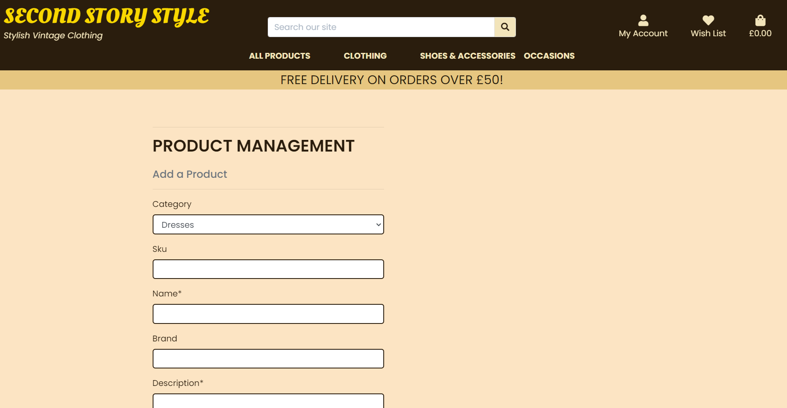

The form is comprehensive, covering all necessary product details including name, description, price, category, size, and an option to upload product images. The use of the Django crispy_forms library ensures that each field is rendered neatly, maintaining a clean aesthetic that aligns with the rest of the site's design. The form is also equipped with multipart/form-data encoding to handle image uploads effectively, ensuring that high-quality visuals can be associated with each product.

Security measures are in place to ensure that only superusers have access to this page, safeguarding against unauthorized product modifications or additions. This exclusivity reinforces the control and integrity of the product database.

"Cancel" button redirects back to the product list, allowing for easy exit without changes, and an "Add Product" button that submits the form, adding the new product to the inventory. 

<br>

- **Edit Product Page**

<br>

The Edit Product Page is another tool tailored specifically for superusers on the website, enabling them to update existing product listings quickly and efficiently. This page provides a streamlined interface where superusers can modify product details such as name, description, price, category, size, and images through a structured form. The form utilizes multipart/form-data for handling image uploads, ensuring that superusers can easily update product visuals along with textual information.

Accessibility to this page is restricted to superusers to maintain control over the product inventory and ensure that any updates to product listings are accurate and authorized.

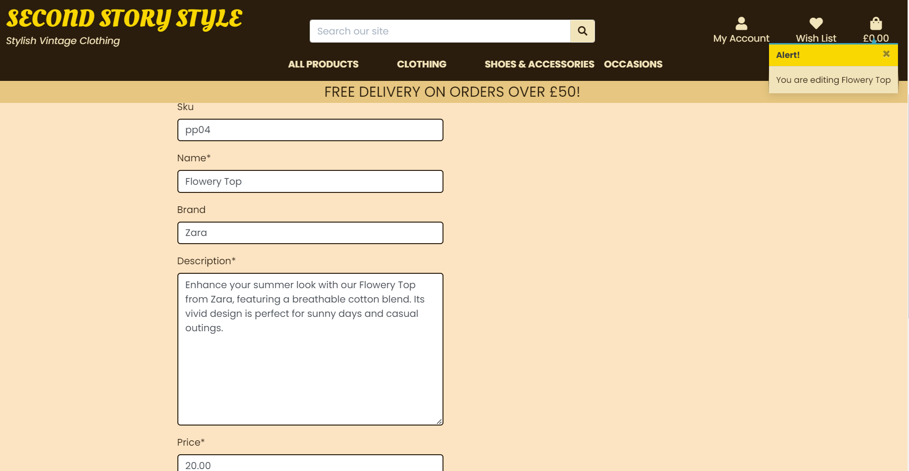

The form is designed for clarity and ease of use, with fields rendered through crispy_forms to maintain consistency and professionalism in the layout. Each field is grouped and labeled appropriately, providing clear guidance for entering product updates. A "Cancel" button allows for immediate exit without changes, redirecting back to the product list, and an "Update Product" button submits the changes, applying them directly to the product listing on the store.

<br>


- **Shopping Bag Page**

<br>

The Shopping Bag page on the website is designed to offer users a detailed and convenient overview of their selected items, enhancing their shopping experience. This page features a clean, structured layout that clearly displays each item in the user's bag, accompanied by its image, description, size, price, and the subtotal for each product. A key interactive component is the ability to view larger images of the products via a modal pop-up, ensuring that users can examine their selections closely before proceeding to checkout.

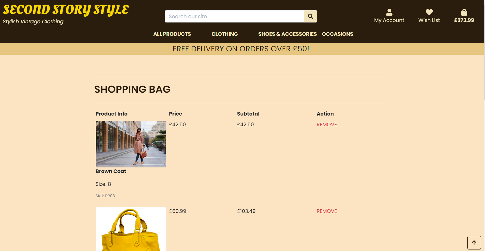

Each item listed in the shopping bag includes a straightforward "REMOVE" link, allowing users to easily remove items directly from the bag without navigating away from the page. This function is supported by JavaScript to handle the removal asynchronously, ensuring a smooth and uninterrupted experience.

The footer of the shopping bag table provides a summary of the total cost, including individual item subtotals and delivery charges. It also dynamically informs users how much more they need to spend to qualify for free delivery, adding an incentive to increase their purchase amount. Below this summary, prominent buttons are displayed for "Keep Shopping" and "Secure Checkout," offering clear paths to either continue shopping or proceed to finalize the purchase. The "Secure Checkout" button is enhanced with a lock icon, reassuring users of the security measures in place.

Additionally, the page includes a "Back to Top" button, providing a convenient way for users to navigate back to the top of the page after reviewing their shopping bag contents. This button is designed to improve user navigation and enhance overall usability, especially on devices where scrolling can be cumbersome.

<br>


- **Wishlist Page**

<br>

The Wishlist Page on the website provides a user-friendly and convenient way for shoppers to keep track of their favorite items. This page features a streamlined layout that displays each product in the wishlist with a clear image, product details, and current pricing. If an image is available, users can click on it to view a larger version in a modal, enhancing their ability to examine products closely.

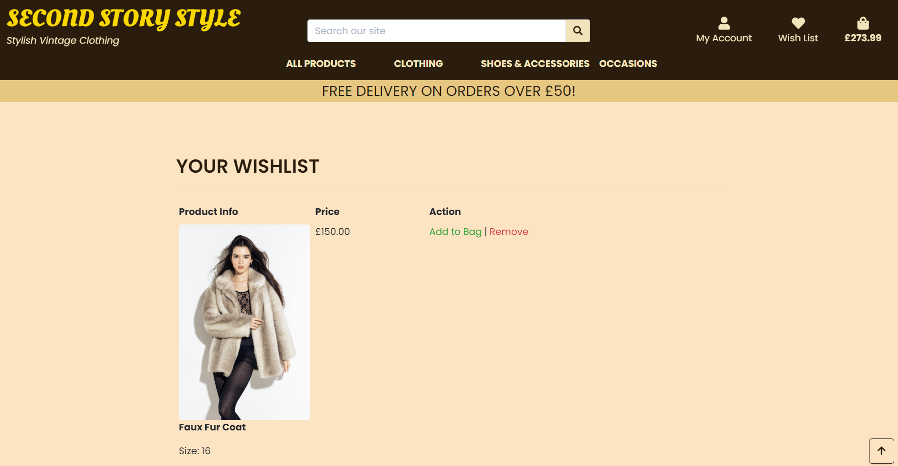

Each product listed on the Wishlist Page includes action links that are clearly labeled, allowing users to either move an item directly to their shopping bag or remove it from the wishlist. These actions are facilitated by straightforward links, ensuring a seamless interaction for the user. The page is designed to be intuitive, with minimalistic yet informative tables that present product information and available actions without clutter.

For users whose wishlists are empty, the page offers a friendly message and a prominent "Keep Shopping" button to encourage continued browsing. Additionally, the inclusion of a "Back to Top" button ensures easy navigation, allowing users to conveniently return to the top of the page after reviewing their wishlist.

<br>

- **Checkout Page**

<br>

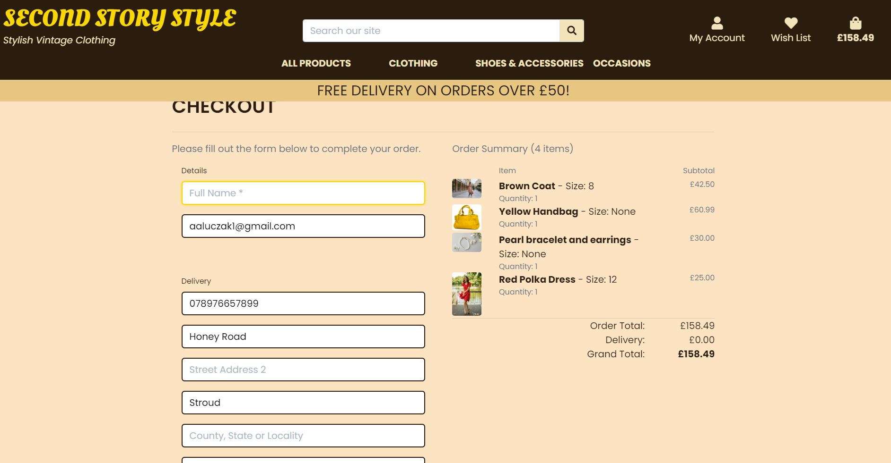

<br>

The Checkout Page on the website is designed to streamline the process of completing purchases, offering a seamless and secure user experience. It is divided into two main sections: the Order Summary and the Payment Form. The Order Summary section provides a concise view of all items in the user's bag, displaying product images, names, sizes, quantities, and prices, along with the subtotal for each item. This section also summarizes the order total, delivery charges, and grand total, ensuring transparency and clarity in pricing.

The Payment Form is detailed and user-friendly, prompting users to fill in their personal details, delivery information, and payment credentials. The form supports saving delivery information for registered users, enhancing convenience for future purchases. For guests, links to sign up or log in are provided to save information, promoting user registration. The form integrates Stripe for secure card payments, ensuring that all transactions are safe and private. A clear indication of the final charge to the card is displayed prominently before submission to avoid any surprises.

Additional features like the "Adjust Bag" button allow users to make last-minute changes to their cart items, while the "Complete Order" button, adorned with a lock icon, reassures users of the security measures in place. The inclusion of a loading overlay with a spinner provides feedback during the processing phase, enhancing the interactive aspect of the page.

<br>

- **Checkout Success Page**

<br>

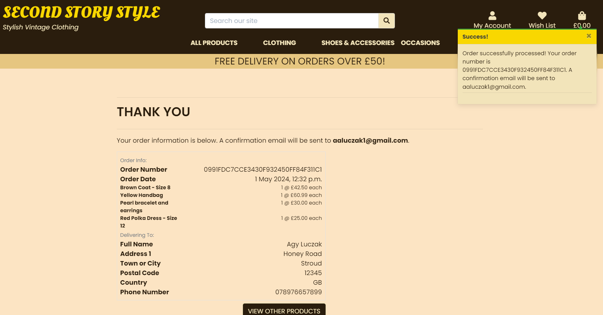

<br>

The Checkout Success Page, also known as the Order Confirmation Page, is designed to provide customers with a clear and detailed summary of their order immediately after purchase. This page serves as a confirmation that the transaction has been successfully completed and provides all the relevant details in a well-organized manner. It includes the order number, order date, and a breakdown of items purchased, including quantity, size, and price per item. Additionally, comprehensive delivery information is displayed, including the full name, address, and contact details provided by the customer.

A key feature of this page is the automatic generation of a confirmation email to the customer's registered email address, reinforcing the order details and providing a permanent record for the customer’s reference. The layout is clean and user-friendly, designed to prevent any post-purchase confusion and to reassure the customer of their successful transaction.

For users coming from a profile page, a "Back to Profile" button is available, allowing them to easily navigate back to their user profile. Alternatively, a "View other products" button encourages continued shopping, enhancing customer engagement and potential additional sales. 

<br>

- **Profile Page**

<br>

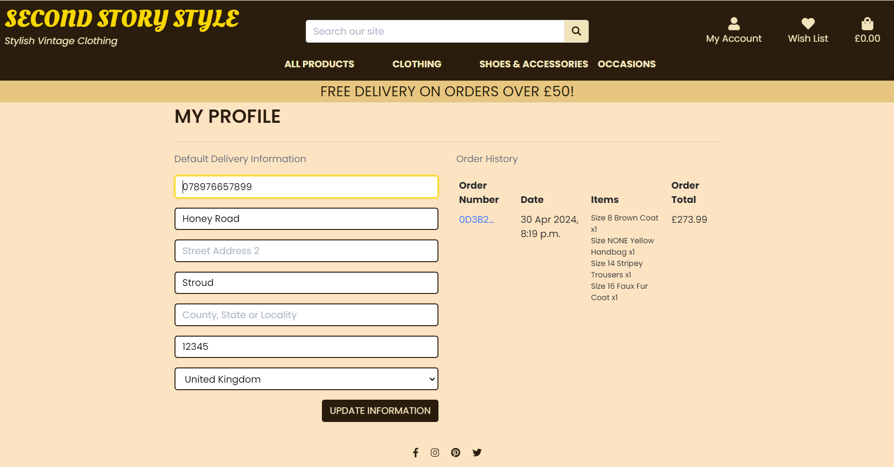
<br>

The Profile Page on the website provides a space for users to manage their personal information and review their order history. This page is divided into two main sections: Default Delivery Information and Order History.

*Default Delivery Information:*

This section is designed for users to update and save their default delivery information, making future checkouts faster and more convenient. The form is pre-populated with the user's current information if available, and can be updated at any time. This form supports the submission of comprehensive details such as address, phone number, and more. It is equipped with crispy_forms to render the fields in a clean, structured format that aligns with the site's overall aesthetic. A button labeled "Update Information" allows users to easily submit their changes, ensuring their latest details are always on file.

*Order History:*

The Order History section provides a detailed look at the user's past purchases. Each order is listed with a clickable order number, date, list of items purchased, and the total cost of the order. This not only allows users to track their spending and review past items but also offers a way to quickly access specific order details through a link to a more detailed order history page. 

<br>

- **Toasts**

<br>

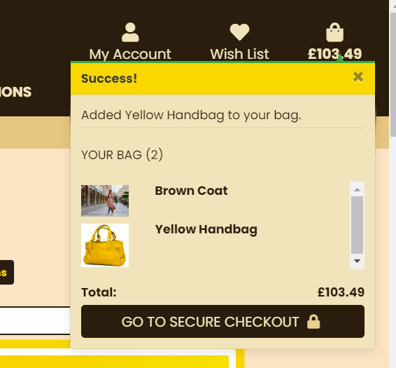

The toasts feature provides users with a quick and visually distinct method of displaying important notifications. Toasts serve as a non-intrusive way to communicate success messages, alerts, and prompts. These notifications allow users to stay informed about actions like adding products to their bag or successfully placing an order. 

<br>

- **Allauth: User Account Management Feature**

<br>

Allauth is an advanced user account management system integrated into the website to provide comprehensive control and seamless user experiences. This feature is crucial for websites requiring user registration and personalization, enabling efficient handling of user data, security, and account-specific functionalities.

<br>


- **Admin Page**

<br>

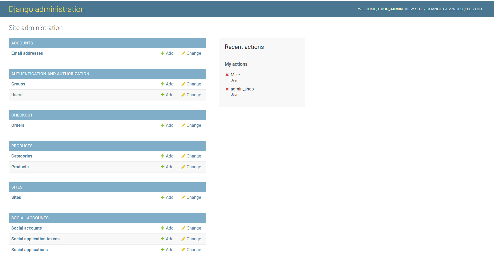

The admin page in Django is exclusively accessible to superusers, who possess elevated privileges to manage the application’s data. Superusers have the capability to create, edit, and delete categories and products, ensuring they maintain precise control over the product catalog. Additionally, they can efficiently create, update, and delete orders, providing comprehensive management of the shop's transactions

<br>

- **Error Pages**

<br>

The error pages feature in the Second Story Style Shop provides users with a clear and user-friendly experience during unexpected scenarios, such as encountering a 404 (Page Not Found) or a 500 (Internal Server Error). These error pages are designed to align with the shop's branding, featuring the shop's logo and a customized message that clearly informs users of the issue, helping to minimize frustration. For 404 errors, the page communicates that the requested page could not be found, while for 500 errors, users are reassured that server issues are being addressed. Each error page includes a prominent call-to-action button directing users back to the homepage, encouraging them to continue exploring the site instead of leaving. This thoughtful design approach ensures that even when things go wrong, users remain engaged and have a positive experience navigating the shop.

<br>

- **Emails**

<br>

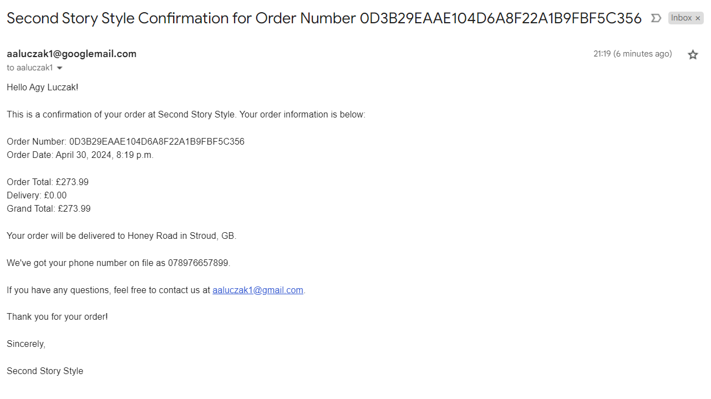

The email feature in the Second Story Style Shop plays a crucial role in enhancing user experience by automating key communication processes, particularly in the areas of email confirmation, account confirmation, and password reset. Upon registration, new users receive an account confirmation email that contains a unique verification link, ensuring that the email address provided is valid and linked to the correct account, thereby enhancing security. For customers who complete a purchase, an order confirmation email is sent immediately after the transaction, summarizing the order details. Additionally, if a user forgets their password or needs to update their credentials, the password reset feature sends a secure link to their registered email, allowing them to reset their password safely. 

<br>


## Tools & Technologies Used

* [HTML](https://en.wikipedia.org/wiki/HTML) used for the main site content
* [CSS](https://en.wikipedia.org/wiki/CSS) used for the main site design and layout
* [JavaScript](https://en.wikipedia.org/wiki/JavaScript) used for user interaction on the site
* [Python version 3.9.12](https://www.python.org) used as the back-end programming language
* [Django version 3.2.25](https://djangoproject.com) used as the Python framework for the site
* [Django Allauth version 0.41.0](https://django-allauth.readthedocs.io/en/latest/) used for authentication, registration & account management.
* [Git](https://git-scm.com) used for version control (`git add`, `git commit`, `git push`)
* [GitHub](https://github.com) used for secure online code storage
* [Heroku](https://heroku.com) used for hosting the deployed back-end site
* [Gitpod](https://gitpod.io) used as a cloud-based IDE for the development
* [ElephantSQL](https://www.elephantsql.com/) used as the relational database
* [Bootstrap 4](https://getbootstrap.com/docs/4.0//) used as the front-end framework for responsiveness and pre-built components
* [Font Awesome](https://fontawesome.com/) used to obtain the icons
* [Google Fonts](https://fonts.google.com/) used to obtain the fonts used in the project
* [Google Developer Tools](https://developers.google.com/web/tools/chrome-devtools) used as a primary method of finding bugs, and testing responsiveness across the project
* [Grammarly](https://www.grammarly.com/) used to check spelling and grammar errors across the project
* [W3C Markup Validation Service](https://validator.w3.org/) used to validate all HTML code written and used on this webpage
* [W3C CSS Validation Service](https://jigsaw.w3.org/css-validator/#validate_by_input) used to validate all CSS code written and used on this webpage
* [JSHint](https://jshint.com/) used to validate all JS code written and used on this webpage
* [PEP8 CI Python Linter](https://pep8ci.herokuapp.com) used to validate all of my Python files
* [AmIResponsive](http://ami.responsivedesign.is/) used to generate responsive images of the website
* [Balsamiq](https://balsamiq.com/wireframes) used to design the wireframes
* [Chat GPT4](https://https://chat.openai.com/) used to generate the shop's logo and the colour palette. Also used along StackOverflow to look for possible causes of issues I came across while doing the project.
* [Readme.so](https://readme.so) used to edit the readme file.
* [Tables generator](https://www.tablesgenerator.com/) used to create a table in a readme file.
* [Canva] used to edit and add text to the logo generated by chatGPT
* [Befunky Photo Editor](https://befunky.com) used to resize and crop the images.
* [Favicon generator](https://www.favicon-generator.org/) used to generate the website's favicon.
* [Stripe](https://stripe.com/gb) has been used in the project to implement the payment system.

<br>                

## **Database Schema**

<br>

I used a relational database as it's suitable for managing the interconnected data structures found in an online shop. 
I have used  [Lucidchart](https://www.lucidchart.com/) to design my site Entity Relationship Diagram (ERD). 

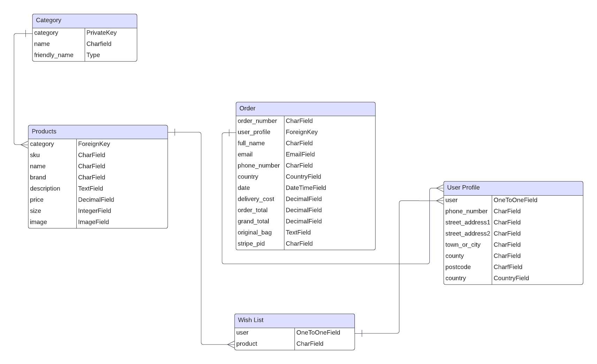

Here's a breakdown of the relationships and purposes of the tables defined:

*Category Table*

The Category table is designed to classify products into various categories such as Painting, Sculpture, etc. Each category is identified by a unique category key, which is linked to the Products table through a foreign key. This relationship ensures that each product is associated with one specific category, helping to organize the inventory in a meaningful way.

*Products Table*

The Products table stores detailed information about individual products. Each product is linked to its respective category via the foreign key category. Additional fields like sku, name, brand, description, price, size, and image provide comprehensive data for each product, enabling effective management and display of the product catalog.

*Wish List Table*

The Wish List table maps products that individual users have marked for future purchase. The user field has a one-to-one relationship with the users, ensuring that each user has a unique wish list that stores references to desired products via the product field.

*User Profile Table*

The User Profile table captures detailed information about users, such as phone number, address, town, county, and country. Each profile is linked to the Wish List table via the user foreign key, ensuring each user's profile contains unique personal data.

*Order Table*

The Order table manages information about user orders. Each order references the User Profile through a foreign key, user_profile, ensuring that orders are linked to the correct user. The table includes fields like order_number, full_name, email, phone_number, and country to store user details, along with date, delivery_cost, order_total, grand_total, original_bag, and stripe_pid for order-specific information.

<br>

# Testing

Please go to [TESTING.md](TESTING.md) file to see the testing section.


# Deployment

**Creating the Live Database**

We have been using the sqlite3 database in development, however this is only available for use in development so we will need to create a new external database which can be accessed by Heroku.

1. Go to the [ElephantSQL](https://www.elephantsql.com/) dashboard and click the create new instance button on the top right.
2. Name the plan (your project name is a good choice), select tiny turtle plan (this is the free plan) and choose the region that is closest to you then click the review button.
3. Check the details are all correct and then click create instance in the bottom right.
4. Go to the dashboard and select the database just created.
5. Copy the URL (you can click the clipboard icon to copy)


**Heroku Deployment**

1. Log into Heroku
2. Create a new app, choose a location closest to you
3. Search for Heroku Postgres from the resources tab and add to your project
4. Make sure to have `dj_database_url` and `psycopg2` installed.
```
pip3 install dj_database_url
pip3 install psycopg2
```
5. Login to the Heroku CLI - `heroku login -i`
6. Run migrations on Heroku Postgres - `heroku run python manage.py migrate`
7. Create a superuser - `python manage.py createsuperuser`
8. Install `gunicorn` - `pip3 install gunicorn`
9. Create a requirements.txt file - `pip3 freeze > requirements.txt`
10. Create a `Procfile` (note the capital P), and add the following,
```
web: gunicorn moose_juice.wsgi:application
```
11. Disable Heroku from collecting static files - `heroku config:set DISABLE_COLLECTSTATIC=1 --app <your-app-name>`
12. Add the hostname to project settings.py file
```
ALLOWED_HOSTS = ['<you-app-name>.herokuapp.com', 'localhost']

```
13. Connect Heroku to your Github, by selecting Github as the deployment method and search for the github repository and pressing `connect`
14. In Heroku, within settings, under config vars select `Reveal config vars`
15. Add the following, 
```
AWS_ACCESS_KEY_ID =	<your variable here>
AWS_SECRET_ACCESS_KEY =	<your variable here>
DATABASE_URL =	<added by Heroku when Postgres installed>
DISABLE_COLLECTSTATIC =	1 
EMAIL_HOST_PASS = <your variable here>
EMAIL_HOST_USER = <your variable here>
SECRET_KEY = <your variable here>
STRIPE_PUBLIC_KEY = <your variable here>
STRIPE_SECRET_KEY = <your variable here>
STRIPE_WH_SECRET = <different from env.py>
USE_AWS = True
```
16. Go back to the Deploy tab and under Automatic deploys choose `Enable Automatic Deploys`
17. Back in your CLI add, commit and push your changes and Heroku will automatically deploy your app
```
git add .
git commit -m "Initial commit"
git push
```
18. Your deployed site can be launched by clicking `Open App` from its page within Heroku.

**AWS S3 Bucket setup**
1. Create an Amazon AWS account
2. Search for S3 and create a new bucket
    - Allow public access
3. Under Properties > Static website hosting
    - Enable
    - index.html as index.html
    - save
4. Under Permissions > CORS use the following:
```
[
  {
      "AllowedHeaders": [
          "Authorization"
      ],
      "AllowedMethods": [
          "GET"
      ],
      "AllowedOrigins": [
          "*"
      ],
      "ExposeHeaders": []
  }
]
```
5. Under Permissions > Bucket Policy:
    - Generate Bucket Policy and take note of Bucket ARN
    - Chose S3 Bucket Policy as Type of Policy
    - For Principal, enter *
    - Enter ARN noted above
    - Add Statement
    - Generate Policy
    - Copy Policy JSON Document
    - Paste policy into Edit Bucket policy on the previous tab
    - Save changes
6. Under Access Control List (ACL):
    - For Everyone (public access), tick List
    - Accept that everyone in the world may access the Bucket
    - Save changes

**AWS IAM (Identity and Access Management) setup**
1. From the IAM dashboard within AWS, select User Groups:
    - Create a new group
    - Click through and Create Group
2. Select Policies:
    - Create policy
    - Under JSON tab, click Import managed policy
    - Choose AmazongS3FullAccess
    - Edit the resource to include the Bucket ARN noted earlier when creating the Bucket Policy
    - Click next step and go to Review policy
    - Give the policy a name and description of your choice
    - Create policy
3. Go back to User Groups and choose the group created earlier
    - Under Permissions > Add permissions, choose Attach Policies and select the one just created
    - Add permissions
4. Under Users:
    - Choose a user name 
    - Select Programmatic access as the Access type
    - Click Next
    - Add the user to the Group just created
    - Click Next and Create User
5. Download the `.csv` containing the access key and secret access key.
    - **THE `.csv` FILE IS ONLY AVAILABLE ONCE AND CANNOT BE DOWNLOADED AGAIN.**

**Connecting Heroku to AWS S3**
1. Install boto3 and django-storages
```
pip3 install boto3
pip3 install django-storages
pip3 freeze > requirements.txt
```
2. Add the values from the `.csv` you downloaded to your Heroku Config Vars under Settings:
3. Delete the `DISABLE_COLLECTSTATIC` variable from your Cvars and deploy your Heroku app
4. With your S3 bucket now set up, you can create a new folder called media (at the same level as the newly added static folder) and upload any required media files to it.
    - **PLEASE MAKE SURE `media` AND `static` FILES ARE PUBLICLY ACCESSIBLE UNDER PERMISSIONS**
