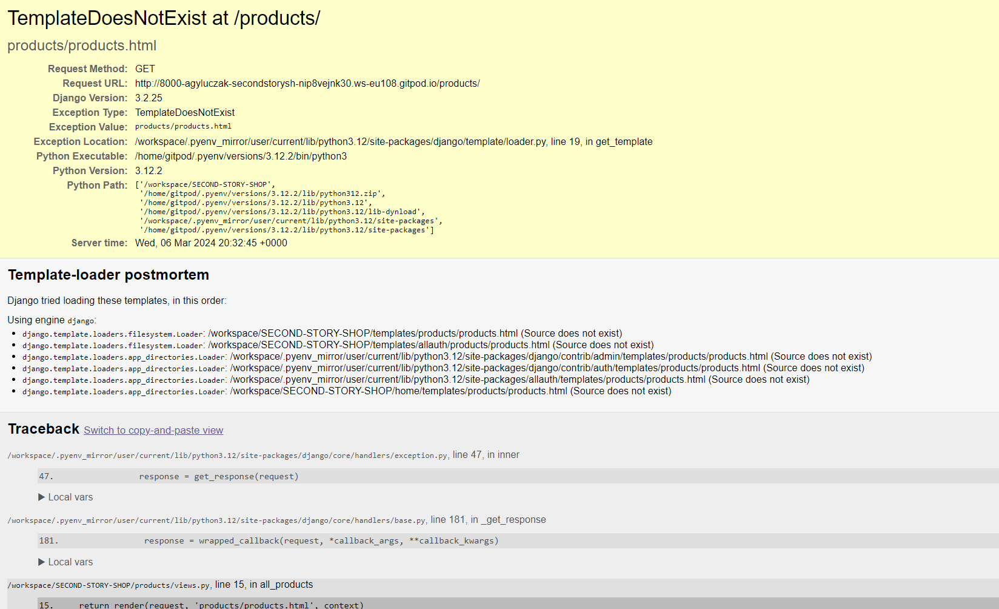

Go back to the [README.md](README.md) file

## User Stories

### Viewing and Navigation

| User Story | Relevant Feautures | Result |
|------------|----------|--------|
| Easily navigate the site and find the products that I need. | Intuitive site layout, consistent menu placements, and clearly labeled sections. | Users can quickly find what they're looking for with minimal clicks. |
| View a category of products/filter products to find specific items I am interested in. | Filters and sorting options available on products page. | Users can refine their searches and browse relevant products efficiently. |
| View more detail on products and read their descriptions. | Product detailpage with detailed descriptions | Users understand what they're buying and feel confident in their choices. |
| View a close-up of a product image. | Zoom-in functionality | Users see detailed product features and quality up-close to make informed decisions. |
| View my running total of purchases throughout my visit. | Shopping cart widget with a running total displayed on all pages. | Users keep track of spending and manage their budget during their shopping session. |
| View the items I currently have selected for purchase and adjust the shopping bag if needed. | Editable shopping cart with options to modify or remove items. | Users tailor their final order with ease, increasing satisfaction and reducing cart abandonment. |
| Add products to a wishlist. | Wishlist feature allowing users to save items for later. | Users can bookmark items of interest to revisit and purchase at a later time. |

### Registration and User Accounts
| User Story | Relevant Features | Result |
|------------|----------|--------|
| Register for an account and view my profile. | Registration form and user profile page. | Users easily create an account and access their personal dashboard. |
| Receive an email to confirm my registration. | Automated email system that sends confirmation upon successful registration. | Users receive immediate verification of their account setup and can confirm their email address. |
| Log in and out to keep my account information secure. | Secure login/logout functionality with session management. | User sessions are protected, enhancing security and privacy. |
| View a profile page, set a default delivery address, and view previous purchases. | Profile management features that allow users to update personal details and view order history. | Users manage their shipping preferences and track past activities conveniently. |
| Reset my password. | Password reset feature with email verification. | Users recover access to their accounts securely in case of forgotten passwords. |

### Sorting and Searching
| User Story |Relevant Features | Result |
|------------|----------|--------|
| Sort the list of available products by categories, size, price, and brand. | Drop-down menus and sorting options on products page. | Users find products that meet their needs and preferences more quickly. |
| Search for a product by name or description. | Search bar on the top of ech page | Users locate specific items efficiently using intuitive search capabilities. |

### Purchasing and Checkout
| User Story | Relevant Features | Result |
|------------|----------|--------|
| View items in my bag to be purchased. | Detailed shopping bag view page that shows all items and prices. | Users review their intended purchases clearly, reducing errors. |
| Adjust the bag and make changes to my purchase before checkout. | Options to change quantity or remove items directly in the shopping bag. | Users customize their order to their satisfaction before finalizing the purchase. |
| Easily enter my payment information. | Secure payment form with debit/credit card option | Users enter their payment details in a straightforward and secure manner. |
| Feel that my personal and payment information is safe and secure. | SSL certification, secure payment gateways, and privacy policies in place. | Users trust the site with their data|
| View an order confirmation after checkout to verify that I haven't made any mistakes. | Order summary page and confirmation details before final submission. | Users confirm details are correct, reducing post-purchase customer service issues. |
| Receive an email confirmation after checking out. | Automated email system that sends a detailed receipt after purchase. | Users have immediate written confirmation of their purchase for their records. |

### Admin and Store Management

| User Story | Relevant Features | Result |
|------------|----------|--------|
| Add a product - add new items to my store. | Admin panel with a form to submit new product details. | Store administrators can quickly expand their inventory. |
| Edit/update a product - change product prices, descriptions, images, and other product criteria. | Editable product listings within the admin dashboard. | Store administrators keep the product listings up-to-date with minimal effort. |
| Delete a product - remove items that are no longer for sale. | Option to delete products directly in the admin interface. | Store administrators manage and store's products effectively. |

### Full Manual Testing

I have performed full manual testing on these devices:

- DELL Inspiron 16 laptop
- DELL Optiplex 2
- Iphone 11
- Samsung Galaxy A52 S

The app has been tested on the following browsers:

- Google Chrome 
- Microsoft Edge
- Safari
- Mozilla Firefox 

| **FEATURE** | **EXPECTED OUTCOME** | **TESTING PERFORMED** | **RESULT** | **PASS/FAIL** |
| --- | --- | --- | --- | --- |
| `Navbar` |
| **Navigation Bar Responsiveness** | Navbar should collapse into a hamburger menu on small screens and expand on larger screens | Resize the browser window to various widths to test responsive behavior | Navbar collapses and expands appropriately at breakpoints | PASS |
| **Home Link in Navbar** | Clicking on the logo redirects to the home page | Clicked on the main logo link | Redirected to the home page | PASS |
| **Search Functionality** | Typing and submitting in the search box should lead to a product search results page | Typed a query into the search box and pressed enter | Redirected to the product results page with relevant product listings | PASS |
| **My Account Dropdown Accessibility** | Dropdown should be accessible and show options based on user authentication status | Checked dropdown both as a guest and as a logged-in user | Correct options displayed under different authentication states | PASS |
| **Register/Login Links** | Clicking on these links should redirect to the respective authentication pages | Clicked on both links | Successfully redirected to the register and login pages | PASS |
| **Logout Functionality** | Clicking 'Logout' should log the user out and redirect them to a page indicating they are logged out | Clicked logout | Logged out and saw a confirmation message | PASS |
| **Wishlist Access** | Clicking the 'Wish List' link should direct to the user's wishlist page | Clicked on 'Wish List' | Redirected to the wishlist page | PASS |
| **Shopping Bag Access** | Clicking on the shopping bag icon should direct to the shopping cart | Clicked on the shopping bag icon | Redirected to the shopping cart page | PASS |
| **Responsive Main Nav** | All products and categories dropdowns should work correctly across devices | Tested dropdown functionality on multiple devices | Dropdowns operate correctly in all tested scenarios | PASS |
| **Delivery Banner** | Banner displaying free delivery threshold should be visible on all pages | Navigated through various pages | Delivery banner consistently visible | PASS |
| **Message Toasts Functionality** | Toast messages should appear for user actions like add to wishlist or sign out | Performed actions that trigger toasts | Toast messages appeared appropriately | PASS |
| `Navbar Dropdowns` |
| **All Products Dropdown** | Dropdown should display options for sorting and viewing all products | Clicked on "All Products" to view dropdown menu | Dropdown displayed with options: By Price, By Brand, By Size, By Category, All Products | PASS |
| **All Products - By Price** | Redirect to products sorted by price in ascending order | Selected "By Price" from dropdown | Redirected to product page sorted by price ascending | PASS |
| **All Products - By Brand** | Redirect to products sorted by brand in ascending order | Selected "By Brand" from dropdown | Redirected to product page sorted by brand ascending | PASS |
| **All Products - By Size** | Redirect to products sorted by size in ascending order | Selected "By Size" from dropdown | Redirected to product page sorted by size ascending | PASS |
| **All Products - By Category** | Redirect to products sorted by category in ascending order | Selected "By Category" from dropdown | Redirected to product page sorted by category ascending | PASS |
| **All Products - View All** | Redirect to page displaying all products | Selected "All Products" from dropdown | Redirected to page displaying all products | PASS |
| **Clothing Dropdown** | Dropdown should list specific clothing categories and an option to view all clothing | Clicked on "Clothing" to view dropdown menu | Dropdown displayed with options: Dresses, Tops, Trousers, Coats, All Clothing | PASS |
| **Clothing - Dresses** | Redirect to page displaying dresses | Selected "Dresses" from dropdown | Redirected to dresses category page | PASS |
| **Clothing - Tops** | Redirect to page displaying tops | Selected "Tops" from dropdown | Redirected to tops category page | PASS |
| **Clothing - Trousers** | Redirect to page displaying trousers | Selected "Trousers" from dropdown | Redirected to trousers category page | PASS |
| **Clothing - Coats** | Redirect to page displaying coats | Selected "Coats" from dropdown | Redirected to coats category page | PASS |
| **Clothing - View All Clothing** | Redirect to page displaying all clothing items | Selected "All Clothing" from dropdown | Redirected to page showing all clothing items | PASS |
| **Shoes & Accessories Dropdown** | Dropdown should list specific accessory categories and options to view each | Clicked on "Shoes & Accessories" to view dropdown menu | Dropdown displayed with options: Shoes, Jewellery, Bags, Hats | PASS |
| **Shoes & Accessories - Shoes** | Redirect to page displaying shoes | Selected "Shoes" from dropdown | Redirected to shoes category page | PASS |
| **Shoes & Accessories - Jewellery** | Redirect to page displaying jewellery | Selected "Jewellery" from dropdown | Redirected to jewellery category page | PASS |
| **Shoes & Accessories - Bags** | Redirect to page displaying bags | Selected "Bags" from dropdown | Redirected to bags category page | PASS |
| **Shoes & Accessories - Hats** | Redirect to page displaying hats | Selected "Hats" from dropdown | Redirected to hats category page | PASS |
| **Occasions Dropdown** | Dropdown should list occasion-specific categories like weddings, ball gowns | Clicked on "Occasions" to view dropdown menu | Dropdown displayed with options: Wedding, Ball Gowns | PASS |
| **Occasions - Wedding** | Redirect to page displaying wedding-appropriate items | Selected "Wedding" from dropdown | Redirected to wedding category page | PASS |
| **Occasions - Ball Gowns** | Redirect to page displaying ball gowns | Selected "Ball Gowns" from dropdown | Redirected to ball gowns category page | PASS |
| `Home Page` |
| **Page Load** | The homepage should load without any errors and display all content correctly. | Accessed the website's homepage. | Homepage loaded successfully with all content displayed as expected. | PASS |
| **Navigation Bar** | The navigation bar should function correctly, providing access to all linked pages. | Clicked on each link in the navigation bar. | Each link directed to the correct page. | PASS |
| **Page Heading and Subheading on Small Screens** | Heading and subheading should be visible only on xs to md screens. | Viewed the page on small screens to check visibility. | Heading and subheading are properly displayed only on xs to md screens. | PASS |
| **Shop Now Button** | Clicking the 'Shop Now' button should redirect the user to the products page. | Clicked the 'Shop Now' button. | Redirected to the products page correctly. | PASS |
| **Logo and Button Layout on Large Screens** | On large screens, the logo and the button should be next to each other. | Viewed the homepage on a large screen. | Logo and button are correctly displayed next to each other. | PASS |
| **Interactive Logo Flip on Click** | The logo should flip to reveal text on the back when clicked. | Clicked the logo to activate the flip effect. | Logo flipped correctly, revealing the text on the back. | PASS |
| **Accessibility of Flip Container** | The flip container should be easily clickable and should toggle its state on each click. | Repeatedly clicked the flip container. | Flip action worked correctly with each click. | PASS |
| **Vertical Stacking on Smaller Screens** | On smaller screens, the logo and 'Shop Now' button should stack vertically. | Checked the layout on smaller devices. | Elements are stacking vertically as expected. | PASS |
| **Text Visibility in Flip Container** | Text in the flip container should be clear and legible. | Observed the text in both front and back states of the flip container. | Text is clear and legible in both states. | PASS |
| `Footer` |
| **Footer Visibility** | The footer should always be visible at the bottom of every page. | Scrolled to the bottom on various pages to check visibility. | Footer was consistently visible across all pages. | PASS |
| **Social Media Links** | Links should correctly redirect to the respective social media pages. | Clicked each social link to ensure it opens the correct page. | All links redirected correctly to the specified social media platforms. | PASS |
| **Link Targeting** | Social media links should open in a new tab. | Clicked on social media links to check `target="_blank"`. | Each link opened in a new tab as expected. | PASS |
| **Conditional Styling** | Icons should switch styles between light and dark based on the current path. | Checked icons on the homepage and other pages. | Icons correctly displayed light style on the homepage and dark style on other pages. | PASS
| `Products Page` |
| **Page Load** | The page should load without errors and display products, sorting options, and category links. | Loaded the page and observed for any errors or misloads. | Page loaded successfully with all elements displayed correctly. | PASS |
| **Product Display** | Each product should display an image, name, price, and available actions (wishlist, add to bag). | Checked several product cards for necessary information. | All products correctly displayed their respective details. | PASS |
| **Sorting Functionality** | Changing the sorting options should reorder products based on the selected criteria. | Selected each sorting option from the dropdown and observed the reordering of product listings. | Products were reordered correctly for each selected sorting option. | PASS |
| **Category Links** | Clicking on a category badge should filter the products according to that category. | Clicked on each category badge and checked if only relevant products are shown. | Products were filtered correctly according to selected categories. | PASS |
| **Product Details Link** | Clicking on a product image or name should redirect to the product's detail page. | Clicked on product images and names. | Correctly redirected to the detailed product page for each selected product. | PASS |
| **Add to Wishlist** | Clicking the wishlist button should add the item to the user’s wishlist. Requires login for unauthenticated users. | Clicked the wishlist button as both authenticated and unauthenticated user. | Functioned correctly: redirected to login when not authenticated, and added to wishlist when logged in. | PASS |
| **Add to Bag** | Clicking the add to bag button should add the item to the shopping bag. | Clicked on the add to bag button for multiple products. | Items were successfully added to the shopping bag. | PASS |
| **Back to Top Button** | Clicking the "Back to Top" button should scroll the page back to the top. | Clicked the button after scrolling down on the page. | Page scrolled back to the top smoothly. | PASS |

## Bugs and issues

| No  |  Issue |  Solution |
|---|---|---|
| 1  |  Django template loader could not find the 'products/products.html'   |  Used pathlib path instead of os.path for template DIRS and added '/'. Credit goes to my hackathon teammate Tomislav Dukanez. I remembered him mentioning lack of '/' causing problems in Django and decided to try putting it in the syntax. It worked and the explanation of the pathlib path was found on ChatGPT 4 and [Python Documentation](https://www.python.org)|
| 2 |  Initial products sort correctly by size, but subsequent ones revert to beginning the sort order again  | Changed the size field in your Django model from CharField to IntegerField to make storing data consistent  |
|   |   |   |
|   |   |   |
|   |   |   |
|   |   |   |
|   |   |   |